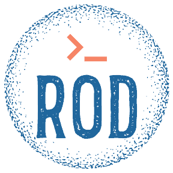

<div align="center">

<a href="https://richionline-portfolio.nw.r.appspot.com"></a>

    


[](https://richionline-portfolio.nw.r.appspot.com) [](https://twitter.com/richionline)

</div>


Flask web for personal portfolio

---

##### Endpoint
https://richionline-portfolio.nw.r.appspot.com

##### Deploy in Google Cloud Platform

```bash
gcloud app deploy
```

##### Setup

```bash
pip install -r requirements.txt
```

##### Running the app

```bash
flask run (with .flaskenv)
```
or
```
flask run -app PATH_APP
```

##### Setup tests

```bash
pip install -r requirements-tests.txt
```

##### Running the tests with pytest and coverage

```bash
./scripts/check_project.sh
```
or
```bash
coverage run -m pytest -v && coverage html --omit=*/venv/*,*/tests/*
```
---

##### Versions

1.0.1 Some new styles and config
1.0.0 First version
